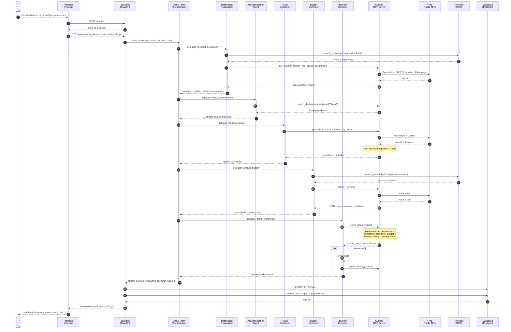

# Sequence Diagram — Trip Planning Flow

> Single-most-useful viva artifact: shows exactly how a user request flows through every layer.

## Key non-obvious points

| Step | Detail |
|---|---|
| 4–6 | Polling, not SSE — Vercel Hobby has a 10s edge timeout; SSE would fail on a 30-second agent run |
| 8 | All MCP calls go over a single shared connection — opened once per `team.arun()` |
| 12, 25 | RAG is searched BEFORE hitting MCP/external APIs — anti-hallucination grounding |
| 16 | TSP algorithm is in the MCP server, not the LLM — the model just calls `optimize_day_route(stops)` |
| 32 | Self-evaluation loop with deterministic scorer; revision triggered only if score < 60 |
| 40–41 | Audit trail persisted to `agent_logs` for the "show your reasoning" UI tab |
